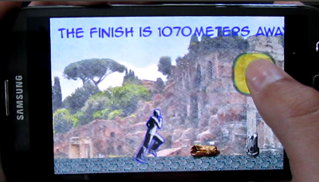
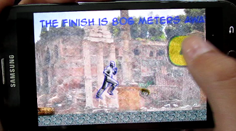

Escape
======
This game was made by a 13 year old boy as part of his
computer programming class.  It is a 2d scroller game with walking 
animation of the player.  The main assignment is to slice up
a 30 cell animation sprite sheet using the pygame library blit.
The individual cells of the animation are stored in a list of 30
elements.

Run the game with:

    $ python main.py




Main concepts
-------------

* Parallax scrolling- The back layer runs slower than the front layer, giving the illusion of depth.
* Main background is "one giant image."  The background is a photograph
that was run through a design filter on Gimp.  The game does not use a 
tile map loader. 
* Begin learning the basics of the pygame.sprite.Sprite class.



Programming
-----------

This is the key section of the lesson:

```python
for y in range(0, sheet_height, player_height):
    for x in range(0, sheet_width, player_width):
    
        player = pygame.Surface((player_width, player_height))
        player.blit(player_sheet, (0, 0), (x, y, player_width, player_height))
        color_key = player.get_at((0, 0))
        player.set_colorkey(color_key)
        small_player = pygame.transform.scale(player, (int(player_width / 2.5), int(player_height / 2.5)))
        
        player_list.append(small_player)

player_position = 0
```

Someone asked me how to use the player in the main game loop.  Here's the bit of code for that.

```python
        ## blit the player
        if player_position < len(player_list):
            player_position = player_position + 1
        else:
            player_position = 0
        windowSurface.blit(player_list[player_position - 1], player_rect)
```

Continue Learning
-----------------
Most of the code is in one large block.  My son is learning to put
code into classes and organize the classes into modules.
